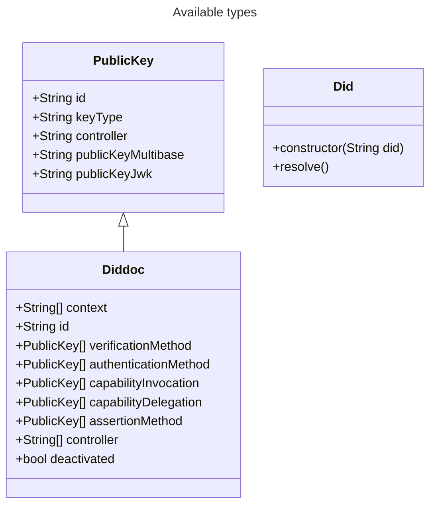

# didresolver

> Latest version of the did methods might not be supported yet

This project contains a didresolver which allows to resolve the following methods:
- [did:web](https://w3c-ccg.github.io/did-method-web/)
- [did:tdw](https://bcgov.github.io/trustdidweb/#create-register)

## Using the library
The library can be used either directly in rust as is or through the different built bindings which are published in different submodules
### Rust
The library can be used directly in rust by adding the following dependency to your `Cargo.toml`:
````toml
[dependencies]
didresolver = {git="https://github.com/e-id-admin/didresolver.git", branch="main"}

# Optional: For manipulating the json content in the example
serde_json = "1.0.115"
````
### Additional language bindings
> General information how the bindings are generated can be found in the [UniFFI user guide](https://mozilla.github.io/uniffi-rs/latest/)

The library is also available in other languages. Please consult the documentation of the subsequent repositories for more information:
- [Examples](https://github.com/e-id-admin/didresolver-examples)
- [Kotlin / Java](https://github.com/e-id-admin/didresolver-kotlin)
- [Kotlin for android](https://github.com/e-id-admin/didresolver-kotlin-android)
- [Swift](https://github.com/e-id-admin/didresolver-swift)

## Example
In the example the following steps are shown:
1. Resolve a did by providing the did string
2. Get different data from DidDoc according to [data model](#models)
```rust
use didresolver::did::Did;

fn main() {
    let did = match Did::new(String::from("did:web:gist.githubusercontent.com:bit-jniestroj:7fb3cce550db5a239b543035298429fe:raw:5e5540c6f67ffe30cca2dfc4bb950a68f412c406")).resolve() {
        Ok(did) => did.as_ref().to_owned(),
        Err(e) => panic!("Error occurred during resolution")
    };
    did.get_verification_method().iter().for_each(|method| {
        println!("id: {}, publicKey: {:?}, publicKeyJwk: {:?}", method.id, method.public_key_multibase, method.public_key_jwk)
    })
}
```

## Models


## License
This project is licensed under the terms of the MIT license. See the [LICENSE](LICENSE.md) file for details.
