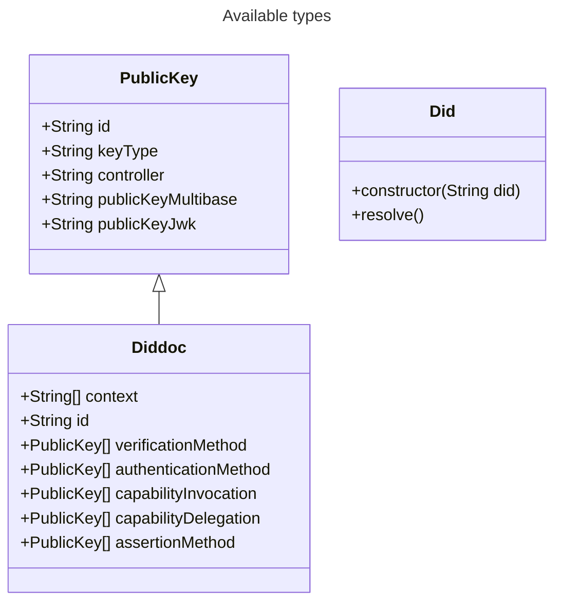

# DID Resolver

## Functionality

Resolves a did and returns the diddoc for the given did.

## Supported DIDs

- did:web
- did:tdw

## Test data

To test the library you can use the `did:web:gist.githubusercontent.com:bit-jniestroj:f23a80ba382f94fdb93436424f6e4e01:raw:d1bfa1f6c0bfee7687e9fc4ca6f86c2340c6b6f5` did. This one resolves to a bbs public key.

## How to use

To resolve a did you first need to create a new Did object. For that you can use the constructor of the did structure that is abailable in the did resolver library. As a parameter you need to pass your did you want to resolve.

After creating the Did object you can call the resolve method on this object. This method returns a diddoc or an error.

### Possible errors

- HttpError: Forward of the http error that happened in the background while trying to access did:web
- DidNotSupported: If the given did is currently not supported by the resolver

## Types

## How to install

### ios

Add the bindings/swift/didresolver.xcframework as a library in xCode
Copy the bindings/swift/files/did.swift to your project

### Android

Add "net.java.dev.jna:jna:5.13.0@aar" as a dependency
Create the folder "bindings/kotlin/jniLibs" under app/src/main
Copy bindings/kotlin/uniffi/did/did.kt to your project (in the package uniffi.did)
