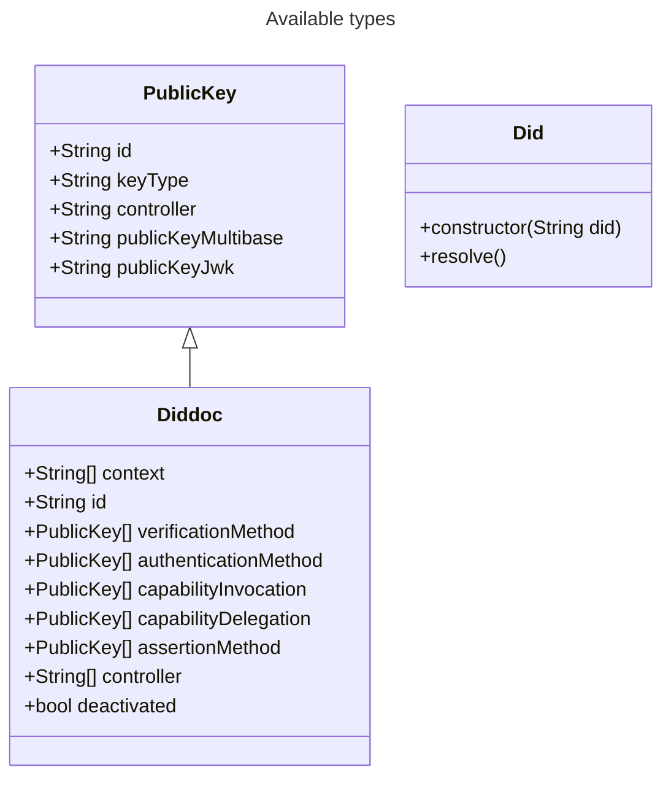

# DID resolver

> Latest version of the DID methods might not be supported yet

An official Swiss Government project made by the [Federal Office of Information Technology, Systems and Telecommunication FOITT](https://www.bit.admin.ch/)
as part of the electronic identity (e-ID) project.

This project contains a DID resolver which allows to resolve the following methods:
- [did:web](https://w3c-ccg.github.io/did-method-web/)
- [did:tdw/did:webvh](https://bcgov.github.io/trustdidweb/#create-register)

## Table of contents

- [Overview](#overview)
- [Using the library](#using-the-library)
- [Example](#example)
- [Models](#models)
- [Contributions and feedback](#contributions-and-feedback)
- [License](#license)


## Overview

This repository is part of the ecosystem developed for the future official Swiss e-ID.
The goal of this repository is to engage with the community and collaborate on developing the Swiss ecosystem for e-ID and other credentials.
We warmly encourage you to engage with us by creating an issue in the repository.

For more information about the project please visit the [introduction into open source of the public beta](https://github.com/e-id-admin/eidch-public-beta).

## Using the library

The library can be used either directly in rust as is or through the different built bindings which are published in different submodules
### Rust
The library can be used directly in rust by adding the following dependency to your `Cargo.toml`:
````toml
[dependencies]
didresolver = {git="https://github.com/swiyu-admin-ch/didresolver.git", branch="main"}

# Optional: For manipulating the json content in the example
serde_json = "1.0.215"
````
### Additional language bindings

> General information how the bindings are generated can be found in the [UniFFI user guide](https://mozilla.github.io/uniffi-rs/latest/)

The library is also available in other languages. Please consult the documentation of the subsequent repositories for more information:
- [Examples](https://github.com/swiyu-admin-ch/didresolver-examples)
- [Kotlin / Java](https://github.com/swiyu-admin-ch/didresolver-kotlin)
- [Kotlin for android](https://github.com/swiyu-admin-ch/didresolver-kotlin-android)
- [Swift](https://github.com/swiyu-admin-ch/didresolver-swift)

## Example

In the example the following steps are shown:
1. Convert supplied DID string into the standard did representation, if possible
2. Fetch a raw DID log, using the url embedded in the did object created previously, if available 
3. Try resolving the raw DOD log into a DID doc
4. Get different parts from the DID doc w.r.t. [data model](#models)
```rust
use didresolver::did::Did;
use ureq::get as fetch_url;

fn main() {
    let did = Did::new(String::from("did:tdw:QmZ3ZcSA52uEaPahx9SQL4xfjcfJ2e7Y8HqNv2sohG1iK7:gist.githubusercontent.com:vst-bit:8d8247633dbc5836324a81725c1216d8:raw:fde1612e271991f23e814943d7636a4dbac6752b"));

    let url = match did.get_url() {
        Ok(url) => url,
        Err(e) => panic!("invalid (unsupported or malformed) DID supplied")
    };
    let did_log_raw = fetch_url(&url).call().into_string().unwrap();
    
    let did_doc = match did.resolve(did_log_raw) {
        Ok(did_doc) => did_doc,
        Err(e) => panic!("Error occurred during resolution")
    };
    
    did_doc.get_verification_method().iter().for_each(|method| {
        println!("id: {}, publicKey: {:?}, publicKeyJwk: {:?}", method.id, method.public_key_multibase, method.public_key_jwk)
    })
}
```

## Models

## Contributions and feedback

We welcome any feedback on the code regarding both the implementation and security aspects. Please follow the guidelines for contributing found in [CONTRIBUTING.md](./CONTRIBUTING.md).

## License
This project is licensed under the terms of the MIT license. See the [LICENSE](LICENSE.md) file for details.
